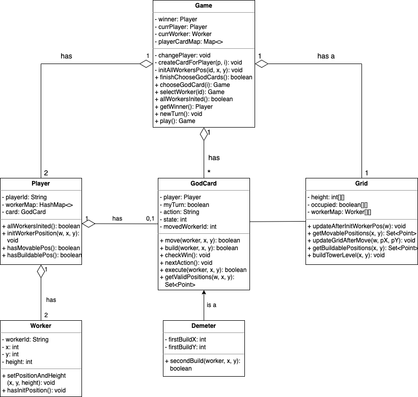

## Extensibility
This implement utilizes an abstract class to define basic game rules and sloves the extensibility issue through adding god card subclasses that extend the superclass. It is decoupled from the base game and new god cards can be easily added by creating a new subclass, which makes the game extensible. Decorator patten can be an alternative to add different features of god cards. In this way, each god card class has to implement all methods the interface defined, which increases code duplication and decreases coupling.

## Design Pattern
Template method pattern is used in this application. The abstract GodCard class defines basic rules and implements basic actions like move and build. If god card subclasses that extend GodCard have special powers to change the basic rules, they can customize the operation by overriding the corresponding methods.

In Santorini, god cards should be allowed to take additional actions and change winning rules instead of the basic one. Therefore, an abstract class defining basic rules with subclasses allowed to override basic behaviors is an efficient way to implement this game. It is designed for reuse that each god card only needs to override actions it needs to change when adding new god cards. It increases coupling, but has high coheison, reduce code duplication and is easy for extension. Compared with other design patterns using interface to extend god cards with the game, it needn't implement every action in each god card subclass.